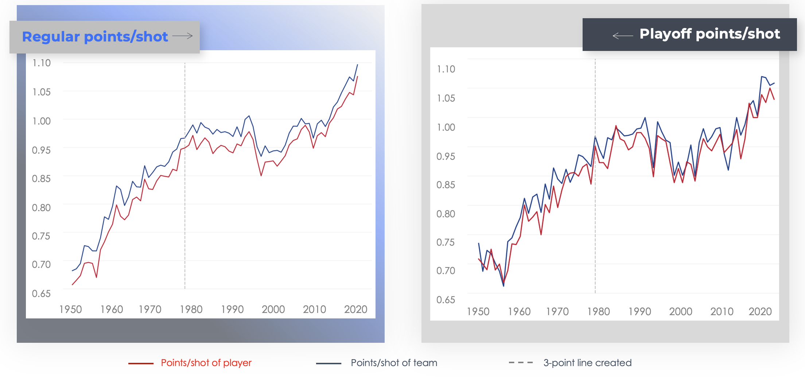
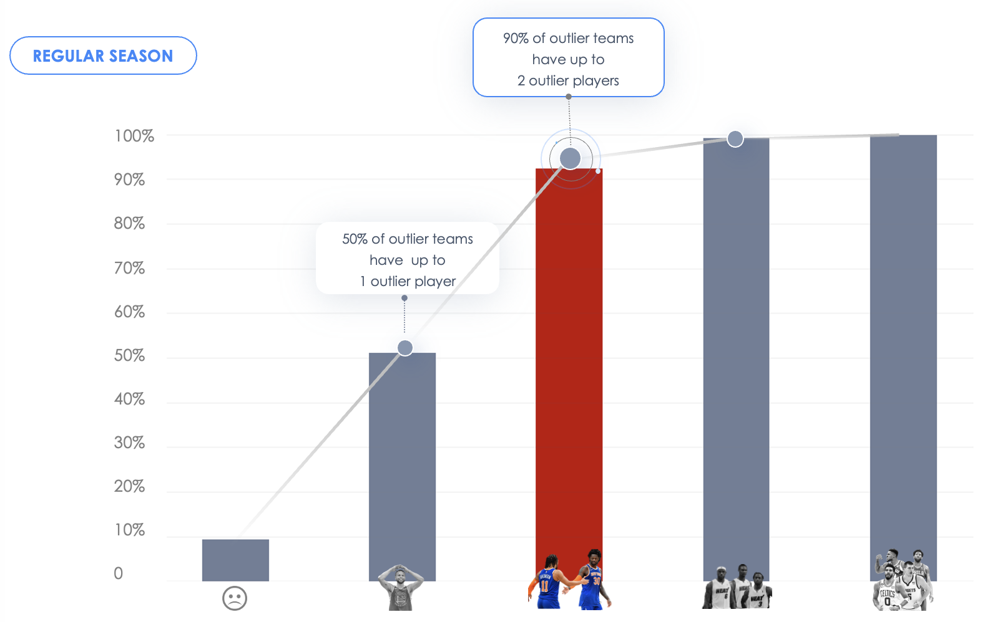
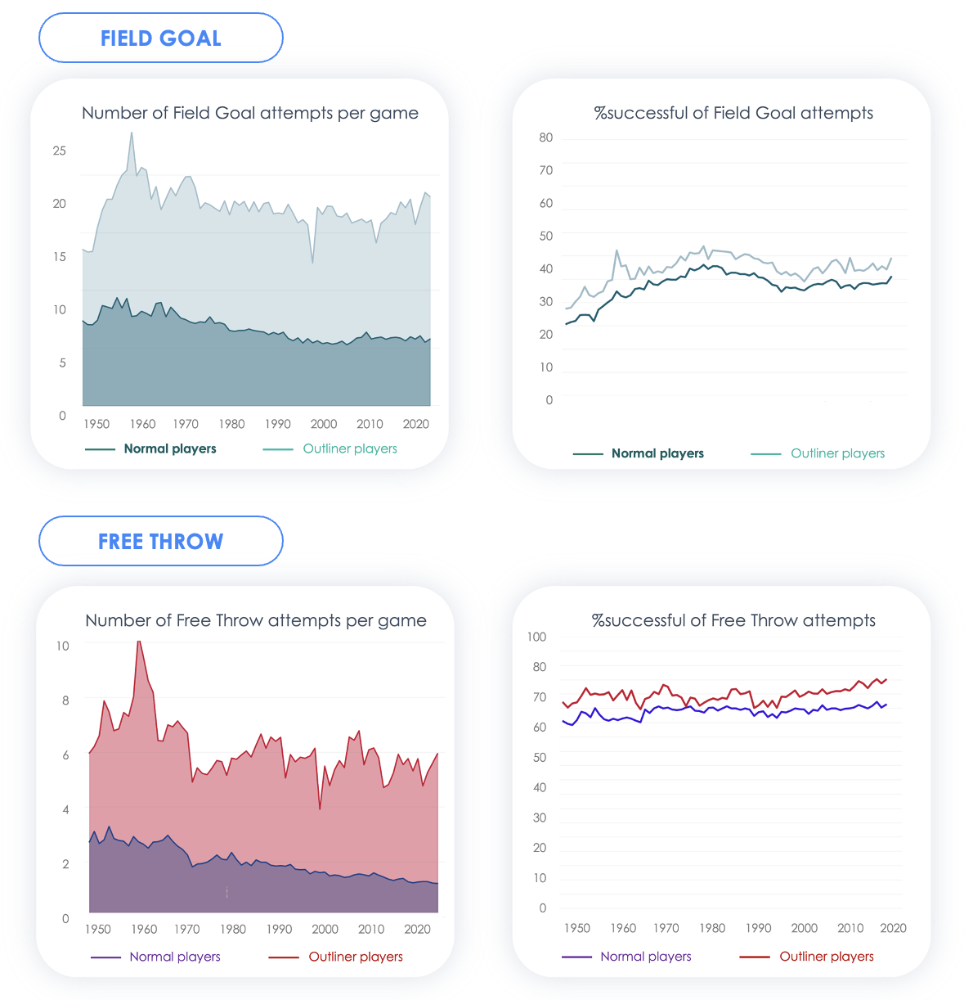

# Exploratory Data Analysis: NBA stats from the last 71 year
## About
The NBA, founded in 1946, is the world's premier professional basketball league. With 30 teams, it features intense competition and iconic players. The season includes regular games and playoffs, culminating in the highly anticipated NBA Finals. The league boasts legendary athletes like Michael Jordan, Kobe Bryant, and LeBron James, shaping global sports culture. With a devoted fan base and international talent, the NBA remains a dominant force in professional sports. In 2022, the NBA achieved remarkable milestones, garnering 100 million viewers, a valuation of $86 billion, and a revenue of 100 million dollars.

## Project Description
- In this project, we use Python to delve into historical NBA statistics spanning 71 years to extract valuable insights. The context is that we are managing an NBA team with a primary objective of maximizing revenue. The central question driving this project is: How can we strategically enhance revenue generation? 
- Due to the absence of direct revenue data in the dataset, you've conducted desk research and identified a strong correlation between winning rate and revenue. As a result, you've chosen to prioritize winning rate as the key metric to pursue for revenue enhancement.

  

## Data Exploratory

**1. Data Source:** The dataset has been obtained from Kaggle, specifically scraped from the NBA Official Leaders page.

**2. Dataset Characteristics:**

- Each row is organized by player, season, and season type.
- Total of 31 Columns and 33,330 rows.
- Contains 6 Categorical Variables, 1 Datetime Variable, 6 Continuous Variables, and 18 Discrete Variables.
- Notes: O/D Rebounds, Steals, and Blocks are null before the 1973-74 season. Similarly, 3-Point Statistics and Turnovers are null before the 1979-80 season.
- 
**3. Struture of EDA:**
  - Basic Data Cleaning: Address missing values and perform necessary data type conversions to ensure data integrity.
  - Introduce New Metric: Define a new metric called "Points Per Shot" (PPS) to assess player efficiency.
  - Define Criteria for Top Players and Teams: Establish specific criteria or metrics for identifying top-performing players and teams.
  - Analyze Relationship: Investigate the correlation between the number of top-performing players and the overall winning rate of the top teams.
**4. Libraries Used:** Numpy, Pandas, Matplotlib, Seaborn

## Results and Visualizations

  

The graph illustrates a strong correlation between a player's Points Per Shot (PPS) and the team's performance, highlighting the significant influence of individual player performance on the overall success of the team.

  
  

The graph displays a Cumulative Distribution Function (CDF) representing the presence of top players in top teams during the Regular Season. Notably, 90% of outlier teams possess up to 2 outlier players, underscoring the essential role of exceptional talented players in propelling a team to the highest levels of performance.

  

This graph demonstrates that both outlier and normal players achieve similar success rates, averaging around 35-40% for field goals and approximately 70% for free throw attempts. However,  what sets top players apart is their remarkable number of attempts, with twice as many field goal attempts and three times as many free throw attempts compared to their counterparts.(This graph pertains to the Regular Season, but a similar trend is observed in the Playoff Season).

## Outcomes:

The exploratory data analysis reveals several key insights:
- **Impact of Top Players:**
  The presence of two top players on a team demonstrates a strong correlation with an increased the probability of winning.
- **Player Performance Strategy:** Interestingly, a strategic approach for players aiming to attain top status involves maximizing the number of attempts, particularly in free throws, rather than focusing solely on accuracy.
  
These findings provide valuable strategic considerations for both team management and individual players looking to optimize performance and outcomes in the NBA.

## Files and Directories:
- README.md: Contains the project description.
- images/: Directory containing all images and visualization files.
- NBA_code.ipynb: Jupyter Notebook with the NBA data analysis code.
- NBA_presentation.pdf: Presentation slides summarizing the project findings.

## Authors:
- Yen Phan
- Obtin Zandian

## Sources:
- https://www.kaggle.com/datasets/ricardotorresheredia/nba-stats-from-the-last-71-years
- https://www.cnbc.com/2021/10/18/nba-2021-2022-season-10-billion-revenue-tv-viewership-rebound.html
- https://www.forbes.com/sites/mikeozanian/2022/10/27/nba-team-values-2022-for-the-first-time-in-two-decades-the-top-spot-goes-to-a-franchise-thats-not-the-knicks-or-lakers/?sh=1923f1911cce

 
